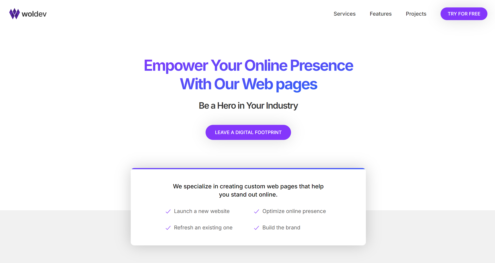
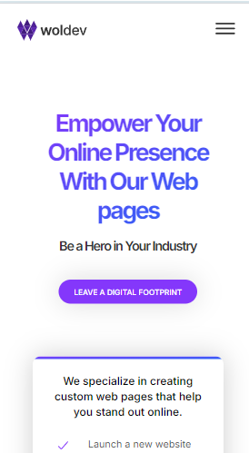

# WolDev: Future Company Website

[Live Demo](https://woldev.netlify.app/)

## Project Description
WolDev is a prototype website created as an initial concept for a future company. It showcases a minimalistic design, serving as the foundation for further enhancements and functionality improvements. This website reflects a starting point for branding and online presence.

---

## Features
- **Minimalistic Design**: A clean and simple layout focused on presenting essential information.
- **Prototype for Future Development**: Acts as a baseline for building more robust features and UI.
- **Responsive Layout**: Designed to work across various devices.

---

## Technologies Used
- **HTML5**: For structuring content.
- **CSS3**: For styling and layout.
- **JavaScript**: For basic interactivity.

---

## Setup Instructions
To run this project locally, follow these steps:

1. Clone the repository:

   ```bash
   git clone https://github.com/AndNijaz/woldev.git
   ```

2. Navigate to the project directory:

   ```bash
   cd woldev
   ```

3. Open `index.html` in your preferred browser.

---

## Usage
Explore the prototype to:

- Understand the basic structure and design vision for the company website.
- Identify areas for improvement and potential new features to implement.

---

## Screenshots

### Desktop View


### Mobile View


> *Screenshots are stored in the `/img` directory.*

---

## Project Status
This project is currently a **prototype** and is under development. Future plans include adding:
- Enhanced UI/UX features.
- Additional pages and content.
- Dynamic functionality using modern frameworks.

---

## Acknowledgements
This project is self-initiated as a vision for a future company. It serves as a learning and development opportunity to explore ideas and design principles.

---

## Live Demo
Check out the live version here: [WolDev Website](https://woldev.netlify.app/)
